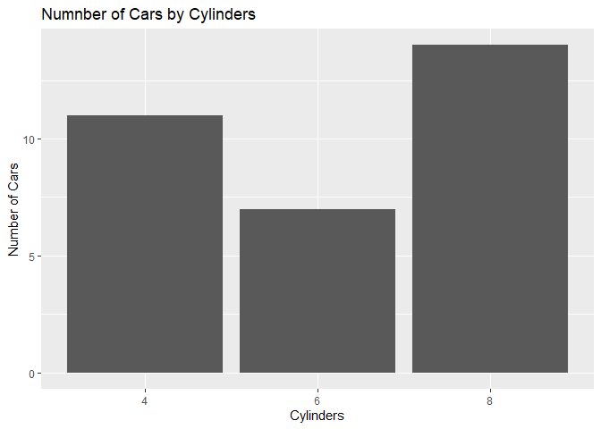
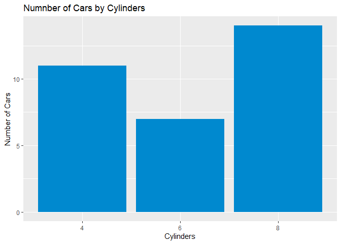

<!-- README.md is generated from README.Rmd. Please edit that file -->

# gedsb

<!-- badges: start -->
<!-- badges: end -->

The goal of the `gedsb` package is to provide the visual identity
ggplot2 theme for charts and tables.

## Installation

You can install the development version of gedsb from
[GitHub](https://github.com/) with:

``` r
# install.packages("devtools")
devtools::install_github("grousell/gedsb")
```

## Example

By loading the package the theme is automatically set.

``` r
library(gedsb)
library (ggplot2)
#> Warning: package 'ggplot2' was built under R version 4.1.3
library (dplyr)
#> Warning: package 'dplyr' was built under R version 4.1.3
#> 
#> Attaching package: 'dplyr'
#> The following objects are masked from 'package:stats':
#> 
#>     filter, lag
#> The following objects are masked from 'package:base':
#> 
#>     intersect, setdiff, setequal, union

basic_plot <- mtcars |>
  group_by (cyl) |>
  count () |>
  mutate (cyl = factor (cyl)) |>
  ggplot(aes (x = cyl, y = n)) +
  geom_col() + 
  labs(
    title = "Number of Cars by Cylinders",
    x = "Cylinders",
    y = "Number of Cars"
  ) 

basic_plot
```



GEDSB colors are automatically loaded as well.

``` r
plot_colored <- mtcars |>
  group_by (cyl) |>
  count () |>
  mutate (cyl = factor (cyl)) |>
  ggplot(ggplot2::aes (x = cyl, y = n)) +
  geom_col(fill = gedsb_colours("Blue")) + # Colour added here
  labs(
    title = "Number of Cars by Cylinders",
    x = "Cylinders",
    y = "Number of Cars"
  ) 

plot_colored
```


