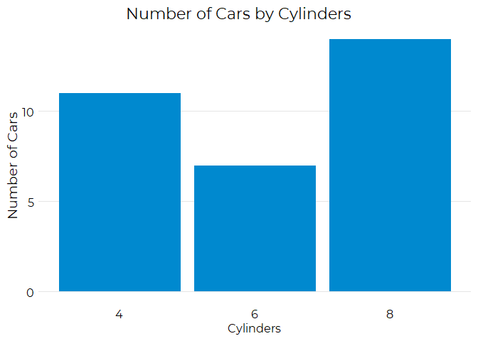

<!-- README.md is generated from README.Rmd. Please edit that file -->

# gedsb

<!-- badges: start -->
<!-- badges: end -->

The goal of the `gedsb` package is to provide the visual identity
ggplot2 theme for charts and tables.

## Installation

You can install the development version of gedsb from
[GitHub](https://github.com/) with:

``` r
# install.packages("devtools")
devtools::install_github("grousell/gedsb")
```

## Example

By loading the package the theme is automatically set.

``` r
library(gedsb)
library (ggplot2)
#> Warning: package 'ggplot2' was built under R version 4.1.3
library (dplyr)
#> Warning: package 'dplyr' was built under R version 4.1.3
#> 
#> Attaching package: 'dplyr'
#> The following objects are masked from 'package:stats':
#> 
#>     filter, lag
#> The following objects are masked from 'package:base':
#> 
#>     intersect, setdiff, setequal, union

basic_plot <- mtcars |>
  group_by (cyl) |>
  count () |>
  mutate (cyl = factor (cyl)) |>
  ggplot(aes (x = cyl, y = n)) +
  geom_col() + 
  labs(
    title = "Number of Cars by Cylinders",
    x = "Cylinders",
    y = "Number of Cars"
  ) 

basic_plot
```


``` r

basic_plot + 
  gedsb_bar_plot_theme()
#> Warning in grid.Call(C_stringMetric, as.graphicsAnnot(x$label)): font family not
#> found in Windows font database
#> Warning in grid.Call(C_stringMetric, as.graphicsAnnot(x$label)): font family not
#> found in Windows font database

#> Warning in grid.Call(C_stringMetric, as.graphicsAnnot(x$label)): font family not
#> found in Windows font database
#> Warning in grid.Call(C_textBounds, as.graphicsAnnot(x$label), x$x, x$y, : font
#> family not found in Windows font database

#> Warning in grid.Call(C_textBounds, as.graphicsAnnot(x$label), x$x, x$y, : font
#> family not found in Windows font database

#> Warning in grid.Call(C_textBounds, as.graphicsAnnot(x$label), x$x, x$y, : font
#> family not found in Windows font database

#> Warning in grid.Call(C_textBounds, as.graphicsAnnot(x$label), x$x, x$y, : font
#> family not found in Windows font database

#> Warning in grid.Call(C_textBounds, as.graphicsAnnot(x$label), x$x, x$y, : font
#> family not found in Windows font database

#> Warning in grid.Call(C_textBounds, as.graphicsAnnot(x$label), x$x, x$y, : font
#> family not found in Windows font database

#> Warning in grid.Call(C_textBounds, as.graphicsAnnot(x$label), x$x, x$y, : font
#> family not found in Windows font database

#> Warning in grid.Call(C_textBounds, as.graphicsAnnot(x$label), x$x, x$y, : font
#> family not found in Windows font database

#> Warning in grid.Call(C_textBounds, as.graphicsAnnot(x$label), x$x, x$y, : font
#> family not found in Windows font database
#> Warning in grid.Call.graphics(C_text, as.graphicsAnnot(x$label), x$x, x$y, :
#> font family not found in Windows font database
#> Warning in grid.Call(C_textBounds, as.graphicsAnnot(x$label), x$x, x$y, : font
#> family not found in Windows font database
```


GEDSB colors and fonts are loaded with the `gedsb_colours_fonts`
function.

``` r
gedsb_colours_fonts()
#> Registering font with R using windowsFonts(): Agency FB
#> Registering font with R using windowsFonts(): Algerian
#> Registering font with R using windowsFonts(): Arial Black
#> Registering font with R using windowsFonts(): Arial
#> Registering font with R using windowsFonts(): Arial Narrow
#> Registering font with R using windowsFonts(): Arial Rounded MT Bold
#> Registering font with R using windowsFonts(): Bahnschrift
#> Registering font with R using windowsFonts(): Baskerville Old Face
#> Registering font with R using windowsFonts(): Bauhaus 93
#> Registering font with R using windowsFonts(): Bell MT
#> Registering font with R using windowsFonts(): Berlin Sans FB
#> Registering font with R using windowsFonts(): Berlin Sans FB Demi
#> Registering font with R using windowsFonts(): Bernard MT Condensed
#> Registering font with R using windowsFonts(): Blackadder ITC
#> Registering font with R using windowsFonts(): Bodoni MT
#> Registering font with R using windowsFonts(): Bodoni MT Black
#> Registering font with R using windowsFonts(): Bodoni MT Condensed
#> Registering font with R using windowsFonts(): Bodoni MT Poster Compressed
#> Registering font with R using windowsFonts(): Book Antiqua
#> Registering font with R using windowsFonts(): Bookman Old Style
#> Registering font with R using windowsFonts(): Bookshelf Symbol 7
#> Registering font with R using windowsFonts(): Bradley Hand ITC
#> Registering font with R using windowsFonts(): Britannic Bold
#> Registering font with R using windowsFonts(): Broadway
#> Registering font with R using windowsFonts(): Brush Script MT
#> Registering font with R using windowsFonts(): Calibri
#> Registering font with R using windowsFonts(): Calibri Light
#> Registering font with R using windowsFonts(): Californian FB
#> Registering font with R using windowsFonts(): Calisto MT
#> Registering font with R using windowsFonts(): Cambria
#> Registering font with R using windowsFonts(): Candara
#> Registering font with R using windowsFonts(): Candara Light
#> Registering font with R using windowsFonts(): Castellar
#> Registering font with R using windowsFonts(): Centaur
#> Registering font with R using windowsFonts(): Century
#> Registering font with R using windowsFonts(): Century Gothic
#> Registering font with R using windowsFonts(): Century Schoolbook
#> Registering font with R using windowsFonts(): Chiller
#> Registering font with R using windowsFonts(): Colonna MT
#> Registering font with R using windowsFonts(): Comic Sans MS
#> Registering font with R using windowsFonts(): Consolas
#> Registering font with R using windowsFonts(): Constantia
#> Registering font with R using windowsFonts(): Cooper Black
#> Registering font with R using windowsFonts(): Copperplate Gothic Bold
#> Registering font with R using windowsFonts(): Copperplate Gothic Light
#> Registering font with R using windowsFonts(): Corbel
#> Registering font with R using windowsFonts(): Corbel Light
#> Registering font with R using windowsFonts(): Courier New
#> Registering font with R using windowsFonts(): Curlz MT
#> Registering font with R using windowsFonts(): Dubai
#> Registering font with R using windowsFonts(): Dubai Light
#> Registering font with R using windowsFonts(): Dubai Medium
#> Registering font with R using windowsFonts(): Ebrima
#> Registering font with R using windowsFonts(): Edwardian Script ITC
#> Registering font with R using windowsFonts(): Elephant
#> Registering font with R using windowsFonts(): Engravers MT
#> Registering font with R using windowsFonts(): Eras Bold ITC
#> Registering font with R using windowsFonts(): Eras Demi ITC
#> Registering font with R using windowsFonts(): Eras Light ITC
#> Registering font with R using windowsFonts(): Eras Medium ITC
#> Registering font with R using windowsFonts(): Felix Titling
#> Registering font with R using windowsFonts(): Footlight MT Light
#> Registering font with R using windowsFonts(): Forte
#> Registering font with R using windowsFonts(): Franklin Gothic Book
#> Registering font with R using windowsFonts(): Franklin Gothic Demi
#> Registering font with R using windowsFonts(): Franklin Gothic Demi Cond
#> Registering font with R using windowsFonts(): Franklin Gothic Heavy
#> Registering font with R using windowsFonts(): Franklin Gothic Medium
#> Registering font with R using windowsFonts(): Franklin Gothic Medium Cond
#> Registering font with R using windowsFonts(): Freestyle Script
#> Registering font with R using windowsFonts(): French Script MT
#> Registering font with R using windowsFonts(): Gabriola
#> Registering font with R using windowsFonts(): Gadugi
#> Registering font with R using windowsFonts(): Garamond
#> Registering font with R using windowsFonts(): Georgia
#> Registering font with R using windowsFonts(): Gigi
#> Registering font with R using windowsFonts(): Gill Sans Ultra Bold
#> Registering font with R using windowsFonts(): Gill Sans Ultra Bold Condensed
#> Registering font with R using windowsFonts(): Gill Sans MT
#> Registering font with R using windowsFonts(): Gill Sans MT Condensed
#> Registering font with R using windowsFonts(): Gill Sans MT Ext Condensed Bold
#> Registering font with R using windowsFonts(): Gloucester MT Extra Condensed
#> Registering font with R using windowsFonts(): Goudy Old Style
#> Registering font with R using windowsFonts(): Goudy Stout
#> Registering font with R using windowsFonts(): Haettenschweiler
#> Registering font with R using windowsFonts(): Harlow Solid Italic
#> Registering font with R using windowsFonts(): Harrington
#> Registering font with R using windowsFonts(): High Tower Text
#> Registering font with R using windowsFonts(): HoloLens MDL2 Assets
#> Registering font with R using windowsFonts(): Impact
#> Registering font with R using windowsFonts(): Imprint MT Shadow
#> Registering font with R using windowsFonts(): Informal Roman
#> Registering font with R using windowsFonts(): Ink Free
#> Registering font with R using windowsFonts(): Javanese Text
#> Registering font with R using windowsFonts(): Jokerman
#> Registering font with R using windowsFonts(): Juice ITC
#> Registering font with R using windowsFonts(): Kristen ITC
#> Registering font with R using windowsFonts(): Kunstler Script
#> Registering font with R using windowsFonts(): Wide Latin
#> Registering font with R using windowsFonts(): Leelawadee
#> Registering font with R using windowsFonts(): Leelawadee UI
#> Registering font with R using windowsFonts(): Leelawadee UI Semilight
#> Registering font with R using windowsFonts(): Lucida Bright
#> Registering font with R using windowsFonts(): Lucida Calligraphy
#> Registering font with R using windowsFonts(): Lucida Console
#> Registering font with R using windowsFonts(): Lucida Fax
#> Registering font with R using windowsFonts(): Lucida Handwriting
#> Registering font with R using windowsFonts(): Lucida Sans
#> Registering font with R using windowsFonts(): Lucida Sans Typewriter
#> Registering font with R using windowsFonts(): Lucida Sans Unicode
#> Registering font with R using windowsFonts(): Magneto
#> Registering font with R using windowsFonts(): Maiandra GD
#> Registering font with R using windowsFonts(): Malgun Gothic
#> Registering font with R using windowsFonts(): Malgun Gothic Semilight
#> Registering font with R using windowsFonts(): Marlett
#> Registering font with R using windowsFonts(): Matura MT Script Capitals
#> Registering font with R using windowsFonts(): Microsoft Himalaya
#> Registering font with R using windowsFonts(): Microsoft Yi Baiti
#> Registering font with R using windowsFonts(): Microsoft New Tai Lue
#> Registering font with R using windowsFonts(): Microsoft PhagsPa
#> Registering font with R using windowsFonts(): Microsoft Sans Serif
#> Registering font with R using windowsFonts(): Microsoft Tai Le
#> Registering font with R using windowsFonts(): Microsoft Uighur
#> Registering font with R using windowsFonts(): Mistral
#> Registering font with R using windowsFonts(): Modern No. 20
#> Registering font with R using windowsFonts(): Mongolian Baiti
#> Registering font with R using windowsFonts(): Monotype Corsiva
#> Registering font with R using windowsFonts(): Montserrat Black
#> Registering font with R using windowsFonts(): Montserrat
#> Registering font with R using windowsFonts(): Montserrat ExtraBold
#> Registering font with R using windowsFonts(): Montserrat ExtraLight
#> Registering font with R using windowsFonts(): Montserrat Light
#> Registering font with R using windowsFonts(): Montserrat Medium
#> Registering font with R using windowsFonts(): Montserrat SemiBold
#> Registering font with R using windowsFonts(): Montserrat Thin
#> Registering font with R using windowsFonts(): MS Outlook
#> Registering font with R using windowsFonts(): MS Reference Sans Serif
#> Registering font with R using windowsFonts(): MS Reference Specialty
#> Registering font with R using windowsFonts(): MT Extra
#> Registering font with R using windowsFonts(): MV Boli
#> Registering font with R using windowsFonts(): Myanmar Text
#> Registering font with R using windowsFonts(): Niagara Engraved
#> Registering font with R using windowsFonts(): Niagara Solid
#> Registering font with R using windowsFonts(): Nirmala UI
#> Registering font with R using windowsFonts(): Nirmala UI Semilight
#> Registering font with R using windowsFonts(): OCR A Extended
#> Registering font with R using windowsFonts(): Old English Text MT
#> Registering font with R using windowsFonts(): Onyx
#> Registering font with R using windowsFonts(): Optima
#> Registering font with R using windowsFonts(): Palace Script MT
#> Registering font with R using windowsFonts(): Palatino Linotype
#> Registering font with R using windowsFonts(): Papyrus
#> Registering font with R using windowsFonts(): Parchment
#> Registering font with R using windowsFonts(): Perpetua
#> Registering font with R using windowsFonts(): Perpetua Titling MT
#> Registering font with R using windowsFonts(): Playbill
#> Registering font with R using windowsFonts(): Poor Richard
#> Registering font with R using windowsFonts(): Pristina
#> Registering font with R using windowsFonts(): Rage Italic
#> Registering font with R using windowsFonts(): Ravie
#> Registering font with R using windowsFonts(): Rockwell
#> Registering font with R using windowsFonts(): Rockwell Condensed
#> Registering font with R using windowsFonts(): Rockwell Extra Bold
#> Registering font with R using windowsFonts(): Script MT Bold
#> Registering font with R using windowsFonts(): Segoe MDL2 Assets
#> Registering font with R using windowsFonts(): Segoe Print
#> Registering font with R using windowsFonts(): Segoe Script
#> Registering font with R using windowsFonts(): Segoe UI
#> Registering font with R using windowsFonts(): Segoe UI Light
#> Registering font with R using windowsFonts(): Segoe UI Semibold
#> Registering font with R using windowsFonts(): Segoe UI Semilight
#> Registering font with R using windowsFonts(): Segoe UI Black
#> Registering font with R using windowsFonts(): Segoe UI Emoji
#> Registering font with R using windowsFonts(): Segoe UI Historic
#> Registering font with R using windowsFonts(): Segoe UI Symbol
#> Registering font with R using windowsFonts(): Showcard Gothic
#> Registering font with R using windowsFonts(): SimSun-ExtB
#> Registering font with R using windowsFonts(): Snap ITC
#> Registering font with R using windowsFonts(): Stencil
#> Registering font with R using windowsFonts(): Sylfaen
#> Registering font with R using windowsFonts(): Symbol
#> Registering font with R using windowsFonts(): Tahoma
#> Registering font with R using windowsFonts(): Tempus Sans ITC
#> Registering font with R using windowsFonts(): Times New Roman
#> Registering font with R using windowsFonts(): Trebuchet MS
#> Registering font with R using windowsFonts(): Tw Cen MT
#> Registering font with R using windowsFonts(): Tw Cen MT Condensed
#> Registering font with R using windowsFonts(): Tw Cen MT Condensed Extra Bold
#> Registering font with R using windowsFonts(): Verdana
#> Registering font with R using windowsFonts(): Viner Hand ITC
#> Registering font with R using windowsFonts(): Vivaldi
#> Registering font with R using windowsFonts(): Vladimir Script
#> Registering font with R using windowsFonts(): Webdings
#> Registering font with R using windowsFonts(): Wingdings
#> Registering font with R using windowsFonts(): Wingdings 2
#> Registering font with R using windowsFonts(): Wingdings 3

plot_colored <- mtcars |>
  group_by (cyl) |>
  count () |>
  mutate (cyl = factor (cyl)) |>
  ggplot(ggplot2::aes (x = cyl, y = n)) +
  geom_col(fill = gedsbBlue) + # Colour added here
  labs(
    title = "Number of Cars by Cylinders",
    x = "Cylinders",
    y = "Number of Cars"
  ) +
  gedsb_bar_plot_theme()

plot_colored
```


